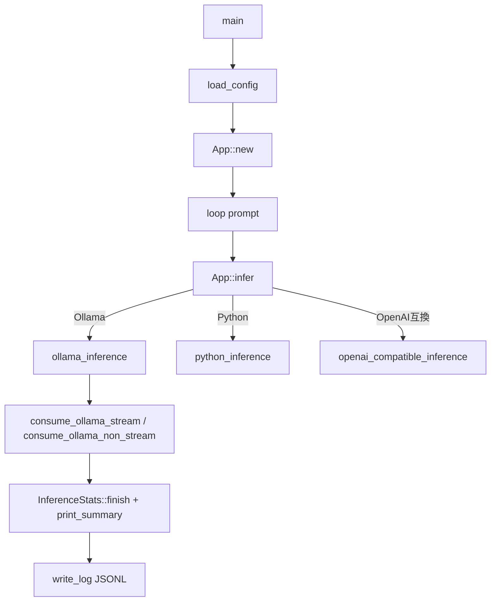
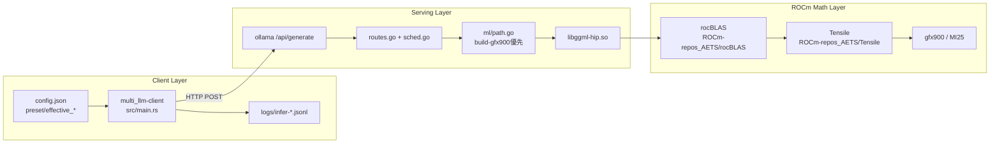
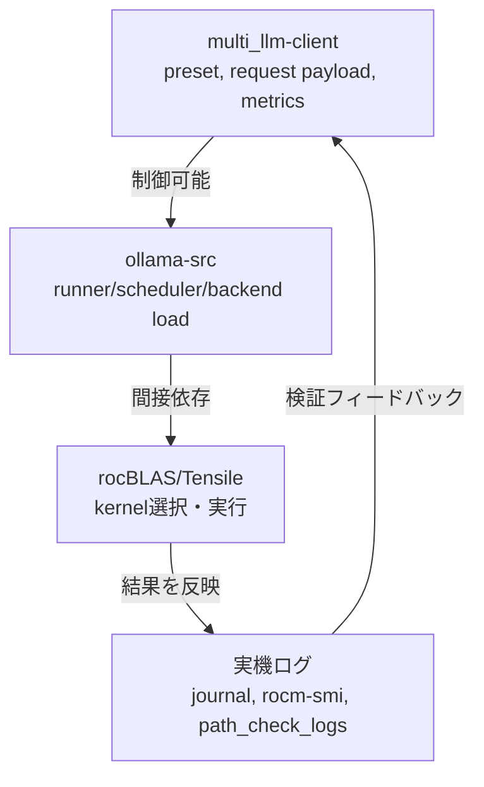

# multi_llm-client Code Index (MI25/gfx900)

最終更新: 2026-03-24
対象: `multi_llm-client`（Rust CLI）

## 1. 目的と責務

`multi_llm-client` は **軽量な実験クライアント層**。

- 担当すること
  - `config.json` の読み込みと preset 解決
  - Ollama/OpenAI互換/Python への推論呼び出し
  - 推論メトリクス（TTFT/total/tok/s）収集
  - JSONL ログ蓄積
- 担当しないこと
  - GPUバックエンドの直接制御（rocBLAS/Tensile 直接呼び出し）
  - ROCmランタイムのデバイス管理

実行時は `POST /api/generate` で `ollama-src` を呼ぶため、**GPU最適化は間接依存**になる。

## 2. ファイル地図

- `src/main.rs`
  - クライアント本体（設定・HTTP・推論・ログ）
- `src/llm_interface.py`
  - `LocalFramework::Python` 用のフォールバック経路
- `config.json`
  - 実行設定（preset/timeout/stream など）
- `logs/infer-YYYY-MM-DD.jsonl`
  - 推論結果と統計の永続ログ
- `README.MD`, `README.ja.md`
  - 利用手順
- `Code_Explanation.MD`
  - 旧解説ドキュメント（現行コードとの差分確認用）

## 3. 構造体と関数の関係

### 3.1 設定系

- `Config`
  - 生設定を保持
  - `effective_max_tokens`, `effective_num_ctx`, `effective_num_batch` で preset 解決
- `EffectiveConfig`
  - 推論時に使う確定値
  - `EffectiveConfig::from_config` で `Config` から派生

### 3.2 推論実行系

- `App`
  - `config`, `effective`, `reqwest::Client` を保持
  - `infer` が入口
    - `python_inference`
    - `ollama_inference`
    - `openai_compatible_inference`

### 3.3 メトリクス/ログ系

- `InferenceStats`
  - 壁時計（`Instant`） + Ollama最終メトリクスを保持
  - `absorb_chunk`, `finish`, `ttft_ms`, `total_ms`, `approx_tok_per_sec`
- `OllamaChunk` / `OllamaFinalMetrics`
  - Ollama NDJSON/JSON 断片からの抽出モデル
- `InferenceLogRecord`
  - JSONL 1行分の出力スキーマ

## 4. 実行フロー（main.rs）

## 5. Ollama/ROCm/rocBLAS/Tensile との関係（コード根拠つき）

## 5.1 直接接続点（multi_llm-client -> ollama-src）

- `multi_llm-client` は `endpoint` へ HTTP POST
  - 既定: `http://127.0.0.1:11434/api/generate`
  - 根拠: `multi_llm-client/src/main.rs` の `DEFAULT_CONFIG` と `build_ollama_request`
- `ollama-src` 側は `/api/generate` を `GenerateHandler` にルーティング
  - 根拠: `ollama-src/server/routes.go:1690`

## 5.2 間接接続点（ollama-src -> ROCm backend）

- gfx900 では `num_parallel=1` を強制
  - 根拠: `ollama-src/server/sched.go:428-431`
- VRAM既定 `num_ctx` に対して gfx900 キャップ挙動あり
  - 根拠: `ollama-src/server/routes.go:1836-1841`
- `build-gfx900/lib/ollama` を優先探索
  - 根拠: `ollama-src/ml/path.go:41-49`
- ROCm デバイスは init validation 対象（rocBLAS クラッシュ回避の防御）
  - 補足: 実装上は CUDA も同様に対象
  - 根拠: `ollama-src/ml/device.go:542-545`

## 5.3 rocBLAS/Tensile との関係（間接依存の実体）

`multi_llm-client` は rocBLAS/Tensile を直接リンクしない。
依存は `ollama-src` の HIP backend (`libggml-hip.so`) 経由で発生する。

- ローカル rocBLAS/Tensile の注入運用
  - `ROCBLAS_TENSILE_LIBPATH`, `LD_LIBRARY_PATH`, `OLLAMA_LIBRARY_PATH` を `ollama-manual.sh` が設定
  - 根拠: `ROCm-MI25-build/ollama-manual.sh:125-131`
- rocBLAS ビルドは AETS fork + Tensile local path 指定
  - 根拠: `ROCm-MI25-build/build-rocblas-gfx900.sh:5-7`, `:104-111`
- rocBLAS 側で gfx900 が target list に含まれる
  - 根拠: `ROCm-repos_AETS/rocBLAS/CMakeLists.txt:84-88`
- Tensile 側で lazy loading オプションが存在
  - 根拠: `ROCm-repos_AETS/Tensile/Tensile/cmake/TensileConfig.cmake:101`, `:157-159`
- Tensile ISA capability では `(9,0,0)` の `v_dot4_i32_i8` が false
  - 根拠: `ROCm-repos_AETS/Tensile/Tensile/AsmCaps.py:128`, `:155-159`

## 5.4 starter-kit との関係

- `ollama-gfx900-starter-kit` は配布成果物（`libggml-hip.so` など）
- `multi_llm-client` は starter-kit 配下の `ollama serve` を endpoint として利用可能
  - 根拠: `ollama-gfx900-starter-kit/README.md:25-32`, `:99`

## 5.5 相関図（Mermaid）

### 5.5.1 実行時依存の全体像

### 5.5.2 責務境界（どこで何を制御するか）

## 6. 計測（TTFT/total/tok/s）設計

- `tok/s`
  - `eval_count / eval_duration(s)` から計算（コードでは ns を秒へ変換してから除算）
- `total_ms`
  - 壁時計と backend `total_duration` の双方がある場合は **大きい方** を採用（計測漏れ防止）
  - 壁時計が 0 の場合は backend 値、backend が無い場合は壁時計値を使う
- `ttft_ms`
  - stream時: first token 到着の壁時計
  - non-stream時: `load_duration + prompt_eval_duration` から近似

## 7. 今回の修正方針と実装点（2026-03-24）

背景:
- 直近ログで `ttft_ms=0`, `total_ms=0` が連続し、比較評価の信頼性を落としていた。

原因:
- 計測開始が `req.send().await` 後だったため、`stream=false` では推論時間の大半を計測から取りこぼすケースがあった。

修正:
- `InferenceStats` 開始を HTTP 送信前へ移動
- non-stream の TTFT を backend metrics から近似するフォールバック追加
- `total_ms` に wall-clock と backend `total_duration` の **max採用ロジック** を追加

実装箇所:
- `multi_llm-client/src/main.rs`
  - `InferenceStats`（`streaming_response` 追加、`ttft_ms`/`total_ms` 改良）
  - `ollama_inference`（計測開始タイミングを `req.send` 前へ移動）

## 8. 次にやる最適化（この地図に沿った順）

1. 計測精度を基準化（今回）
2. preset スイープ（`gfx900_safe/balanced/longctx/tinybench`）
3. fallback_confirmed 証跡の固定（`ollama-src` 実機ログ）
4. 必要なら Rust クライアント本体への tool-calling 拡張

※ 上記4 preset は `src/main.rs` の `Preset` enum と `effective_*` 解決ロジックに実装済み。

## 9. 2026-03-24 preset sweep 結果（tinyllama）

条件:
- 同一プロンプト
- 各 preset 3 回（1回目は preset 切替直後の cold start を含む）
- 指標: `ttft_ms`, `total_ms`, `approx_tok_per_sec`

> 注意: `total_ms` は `max_tokens` の違いの影響を受ける。
> 速度比較の主指標は `tok/s`、遅延比較は `steady2` の `ttft_ms` を優先。

| preset | ttft_ms (all3) | total_ms (all3) | tok/s (all3) | ttft_ms (steady2) | total_ms (steady2) | tok/s (steady2) |
|---|---:|---:|---:|---:|---:|---:|
| `gfx900_safe` | 122.0 | 764.0 | 219.70 | 112.0 | 745.5 | 221.47 |
| `gfx900_balanced` | 595.3 | 1546.7 | 221.14 | 137.5 | 1079.5 | 223.73 |
| `gfx900_longctx` | 698.7 | 1346.7 | 217.42 | 141.0 | 770.0 | 224.77 |
| `gfx900_tinybench` | 620.0 | 803.7 | 197.32 | 118.5 | 281.5 | 219.71 |

暫定結論:
- **安定運用の既定値**: `gfx900_safe`（TTFT 安定）
- **吞吐優先**: `gfx900_balanced`（`tok/s` 高、`longctx` より VRAM 保守的）
- `gfx900_longctx` は長文脈用途で有効だが、通常運用の既定にはやや重い
